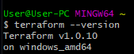

# gcp-terraform-demo
Introduction to cloud automation in Google Cloud

## Pre-requisites
- Access to a shell

    Mac/Linux natively have a good terminal. Windows CMD leaves much to be desired. The setup file here is a Bash script so I would reccomend getting [GitBash](https://git-scm.com/downloads).

- Access to an IDE
    
    I reccomend Visual Studio Code. It's very light weight and has easy to install extensions for almost every use case.

- Git Installed

    Lots of ways to do this. OS dependant [guide](https://git-scm.com/book/en/v2/Getting-Started-Installing-Git). Git comes installed with GitBash.

## Install Google Cloud SDK

Google demo so the Google CLI is required for authentication:

https://cloud.google.com/sdk/docs/install

## Install Terraform
Terraform is a software used to automate cloud deployments.

Instructions: https://learn.hashicorp.com/tutorials/terraform/install-cli

Manual Install
1. Download Terraform ([pre-compiled binary](https://www.terraform.io/downloads.html))
2. Extract folder (note path to use in next step)
3. Add Terraform to PATH or bin folder
    - Windows: Add via GUI ([StackOverflow](https://stackoverflow.com/questions/1618280/where-can-i-set-path-to-make-exe-on-windows))
    - GitBash: `cp ~/Downloads/terraform_1.0.10_windows_amd64/terraform.exe /usr/bin/`
    - Mac/Linux: `cp ~/Downloads/terraform_1.0.10_windows_amd64/terraform.exe /usr/local/bin/`
4. Restart shell and verify installation
    - `terraform --version`
    
   

## Understanding Repo

### Terraform Basics

Terraform is an Infrastructure as Code tool that allows developers to write human-readable files that turn into live infrastructre. The basic terraform workflow is to:
1. Write code
2. Plan changes
3. Apply changes
4. Use service

The code we write is made up of a few key parts:
- Resources - Objects that correspond to infrastructure we want to create. If we want a virtual machine to work on, GCP has a resource called `google_compute_instance`.
- Data - Objects that correspond to existing infrastructure. This allows us to utilize cloud services we do not create.
- Providers - Resource/data definitions. If we want to use Google Cloud resources, we need to include the Google Cloud Provider. 

If you're looking for more resources, there are great tutorials [here](https://learn.hashicorp.com/terraform) 

### Important File Structure
```
gcp-terraform-demo
|  .auto.tfvars
|  auto.tfvars
│  main.tf
|  output.tf
│  resource_*.tf
|  setup.sh
|  vars.tf
└──resources
   ├── footer.html
   └── header.html
```

### **[setup.sh](setup.sh)**
Some basic setup to fully configure the demo. You can ignore this if you are using this repo for your own project.

### **[main.tf](main.tf)**
Main terraform file where base project structure and providers are defined.

### **[resource_*.tf](main.tf)**
This is where we define our resources.

### **[vars.tf](vars.tf)**
This is where we define what variables we want to use. This could be the name of our project or the number of cloud instances we want to use.

### **[.auto.tfvars](.auto.tfvars) (not present untill you run [setup.sh](setup.sh))**
This is where we assign values to variables defined in [vars.tf](vars.tf). Any file with a leading `.` will not be added to version control (our Git repo). We don't want to expose sensitive variables (like passwords or API keys) so we include them in the tracked `.auto.tfvars` file.

### **[output.tf](output.tf)**
This file defines variables we want to inspect easilly or hand off to other terraform modules (modules are larger scope than this project but are used extensively at the enterprise level. You can find out more about them [here](https://www.terraform.io/docs/language/modules/develop/index.html)).

## Running

Start by cloning this repo, entering the folder, and running the setup bash script with:
```
git clone https://github.com/dwp7kp/gcp-terraform-demo.git
cd gcp-terraform-demo
bash setup.sh
```
This will generate a few files you'll need to run Terraform. Most notably the 

```
sudo yum install git -y
curl -sL https://rpm.nodesource.com/setup_10.x | sudo bash -
sudo yum install nodejs -y
git clone https://github.com/amyhua/basic-website-template-node
cd basic-website-template-node
npm install
npm start
```

